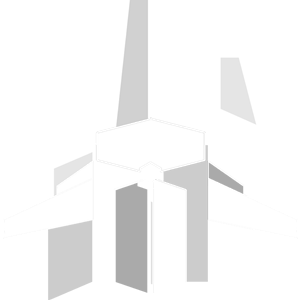
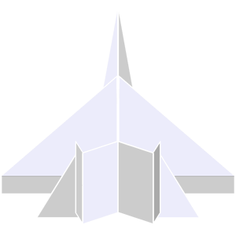
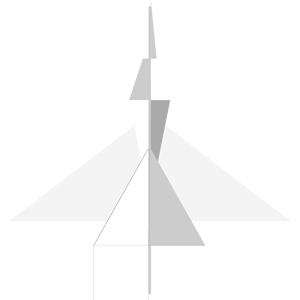
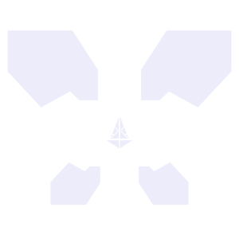
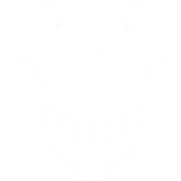

# SPACE SHOOTER
**Space Shooter** is the current working title for a top-down shoot-&lsquo;em-up video game set in space.

In the distant future of 2633 A.D., an unprecedented alien invasion must be stopped by Earth&rsquo;s only hope: the player. Commanding a unit of combat spaceships, they must defend against our enemies and uncover the secrets behind the oncoming opposing force.

## Development
The game is only available for [Microsoft Windows](https://www.microsoft.com/windows) [PCs](https://en.wikipedia.org/wiki/Personal_computer) and is currently built in [C#](https://en.wikipedia.org/wiki/C_Sharp_(programming_language)) using the [Windows Forms](https://learn.microsoft.com/en-us/dotnet/desktop/winforms) [.NET](https://dotnet.microsoft.com/) [API](https://en.wikipedia.org/wiki/API).
Over time, production may shift to [Unity](https://unity.com/), allowing the game to run on more platforms like [Linux](https://www.linux.org/) or the [Web](https://www.w3.org/). &#x1F310;

## Features
Owing to a rough schedule, the game is still in its prototype phase and can only promise some details & facets of its development objectives.
However, feel free to refer to the list in this document for updates on achieved stretch goals or use it as a timeline for the game&rsquo;s eventual completion:
- Bonus effects and weapon effects
- [Couch co-op multiplayer](https://en.wikipedia.org/wiki/Cooperative_video_game) (each player uses a different controller)
- Enemy & player firing/ shooting mechanic + player “Auto-Fire”
- Enemy AI and entity hitboxes
- Keyboard accessibility and Fullscreen support
- Wave progression and “Free Play” mode
- &hellip; other miscellaneous [bugs](https://en.wikipedia.org/wiki/Software_bug) + play testing &#x1F41E;

## Notes
Collection of notable events and updates in Space Shooter&rsquo;s production cycle in a first-person format from its head developer:
- I familiarized myself with [C# features](https://learn.microsoft.com/en-us/dotnet/csharp/) such as access levels, aliasing, casting, inheritance, and storage classes.
- Figured out how to minimally build & run a C# project using an editor and terminal only – no Visual Studio required.
- I interfaced chosen [DLLs](https://en.wikipedia.org/wiki/Dynamic-link_library) into the project&rsquo;s .NET [runtime](https://en.wikipedia.org/wiki/Runtime_(program_lifecycle_phase)).
- Image manipulation ([blurring](https://en.wikipedia.org/wiki/Gaussian_blur), [filling](https://en.wikipedia.org/wiki/Flood_fill), and [transparency](https://en.wikipedia.org/wiki/Alpha_compositing)) works dynamically (and performantly through [multi-threading](https://en.wikipedia.org/wiki/Parallel_computing)) in the game.
- Implemented custom UI layout and rendering; however, user interface classes could improve the code.
- Learned how to programmatically implement many game-specific features like cooldowns, [FPS](https://en.wikipedia.org/wiki/Frame_rate) “stabilizers,” [multi-buffering](https://en.wikipedia.org/wiki/Multiple_buffering), timers, and more&hellip;
- Designed & edited [this evaluation document](#). &#x1F4DD;

## Gallery
### Spaceships
Inspired by paper planes and engineered for future-space offense & defensive maneuvers.

### Aliens
These extra-terrestrials invoke an uncanniness to them that strikes fear into the hearts of even the bravest players.

## Credits
Here&rsquo;s our appreciation for all the people who made this game possible: &#x1F389;
### Development & Programming
- [Lapys](https://www.lapys.dev/) (myself)
### Music
- [Phyrnna](https://www.youtube.com/@Phyrnna/)
